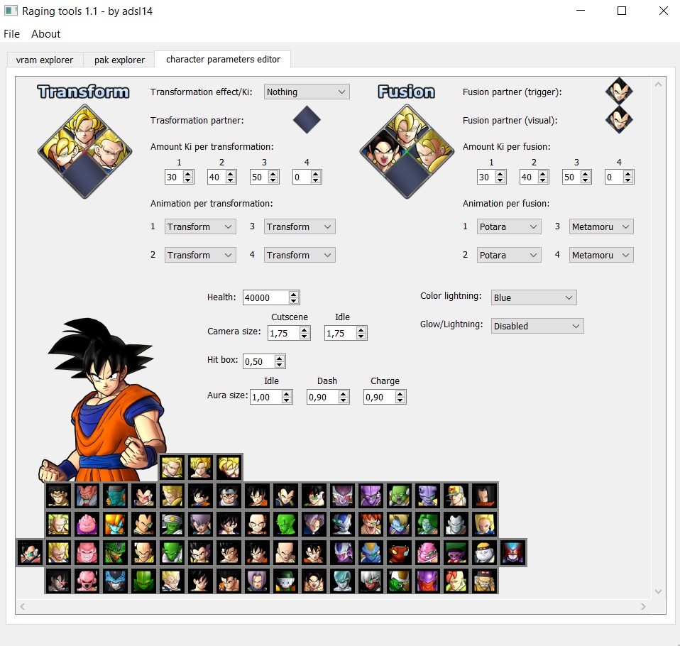

# Raging-tools

This tool will help you in order to edit the games Dragon Ball Raging Blast, Dragon Ball Raging Blast 2 and Dragon Ball Z Ultimate Tenkaichi.

It gather all the tools that were made by adsl14, like [vram explorer](https://github.com/i32camad/vram-explorer), [character parameters editor](https://github.com/i32camad/character-parameters-editor) and pak explorer.

Credits to the Raging Blast Modding community and specially to revelation from [XeNTaX](https://forum.xentax.com) forum who made the compress/uncompress tool.

You can get access to the Raging Blast Modding community in the [Discord](https://discord.gg/tBmcwkGUE6) server.

## vram explorer

<i>vram explorer</i> is a tool that will help you to edit the textures of the game. When you open a <i>.spr</i> and <i>.vram</i> file, it will ask where is the <i>.spr</i> located, also the <i>.vram</i> file. After that, the textures will be loaded.

It will show you for each texture, the <b>Resolution</b>, <b>Mipmaps</b> and <b>Encoding</b>. You can export all the textures, export one of them, or import a new texture.

When importing, the program will check the new texture file and compare it with the original one. If they have differences in resolution, mipmaps or/and encoding, it will tell you that the imported texture could not be shown in the game propertly. 

Check that your imported texture follows the properties of the original one in order to avoid problems. If you are sure that the imported texture will show propertly in the game, you can go on.

## pak explorer

<i>pak explorer</i> is a tool that will unpack the files that has the extension <i>.pak</i>. It uses a <i>Depth-first search</i> since the information in those files are stored with a tree graph structure.

When opens a <i>.pak</i> file, it will store all the sub-files in disk, in order to write the files propertly. When the algorithm finishes, the tool will show the full path of the sub-files.

You can export the files or import a new one. With this you can, for example, swap animations between characters.

## character parameters editor

<i>character parameters editor</i> is a tool that will edit the parameters of the characters, like glow, lightnings, aura size and more.

In order to use this tool, you need to open the file <i>operate_resident_param.pak</i>. Since is a <i>.pak</i> file, the pak explorer will be activated too, and show you all the sub-files that the main pak file has.

When saving, since they are two tools activated at the same time, it will ask you from what tool do you want to gather all the modified data and save it to disk. The options are <i>character parameters editor</i> or <i>pak explorer</i>