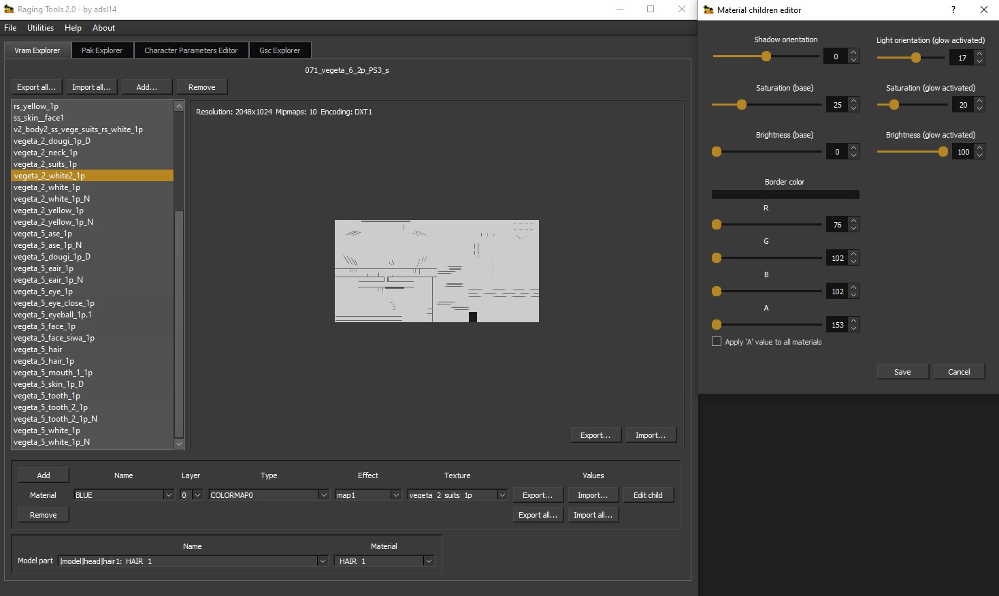
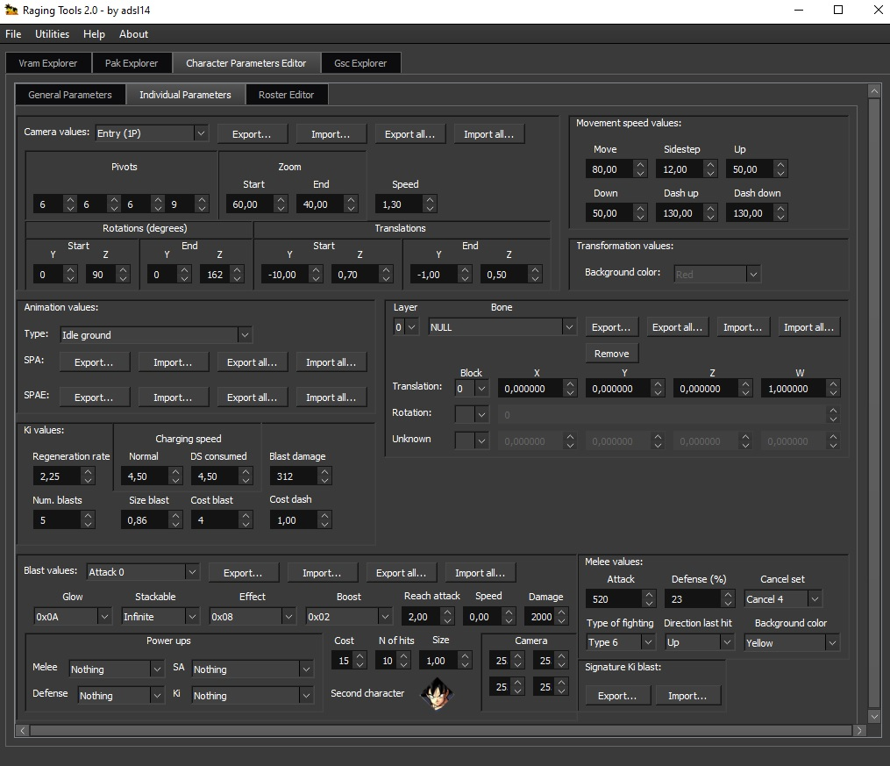

# Raging Tools

Raging Tools is a tool that will help you in order to edit the games from the Raging Blast series. You can edit 
textures, shaders, transformations, parameters, camera values, export/import animations, explore zpak files, etc.

It gathers several tools that were made previously, like [Vram Explorer](https://github.com/adsl14/vram-explorer), 
[Character Parameters Editor](https://github.com/adsl14/character-parameters-editor) and Pak Explorer.

Compatibility list
```
Dragon Ball Raging Blast (PS3 and Xbox 360) -> Only Vram and Pak Explorer
Dragon Ball Raging Blast 2 (PS3 and Xbox 360)
Dragon Ball Z Ultimate Tenkaichi (PS3 and Xbox 360) -> Only Vram and Pak Explorer
```

Credits:
<ul> 
  <li>To <b>revelation (revel8n)</b> from <a href=https://forum.xentax.com>XeNTaX</a> forum who made the 
compress/uncompress tool <i>dbrb_compressor.exe</i> and for his contributions.</li>
  <li>To <b><a href=https://github.com/ascomods>Ascomods</a></b> for his contributions.</li>
  <li>To <b><a href=https://www.youtube.com/c/HiroTenkaichi>HiroTex</a></b> for his contributions.</li>
  <li>To <b><a href=https://www.youtube.com/c/SamuelDBZMAM>SamuelDoesStuff</a></b> for his contributions.</li>
  <li>To <b>316austin316</b> for his contributions.</li>
  <li>To <b>SSJLVegeta</b> for his contributions.</li>
  <li>To <b><a href=https://www.youtube.com/channel/UC4fHq0fbRMtkcW8ImfQO0Ew>LBFury</a></b> for his contributions.</li>
  <li>To the <a href=https://discord.gg/JpCvDCgpnb>Raging Blast Modding community</a>.</li>
</ul>

## Requisites

If you want to run the <b>source code</b>, the required packages are the following:

```
natsort 7.1.1
numpy 1.21.1
pyglet 1.5.16
pyqt5 5.15.4
```

# IMPORTANT!

It is highly recomended to place the tool in <i>Program files</i> because when using <i>Pak Explorer</i>, 
if the path in Windows is very long, the tool will <b>crash!</b>

Windows has a limit for the path name, so run the tool in a place where the path is not too long 
(<i>Program files</i> for example)

## Vram Explorer



<i>Vram Explorer</i> is a tool that will help you to edit the textures of the game. When you open a <i>.spr</i> and 
<i>.vram</i> file, the textures will be loaded.

It will show you for each texture, the <b>Resolution</b>, <b>Mipmaps</b> and <b>Encoding</b>. You can export the 
textures, import over the original, export all the textures, import all the textures from a folder (for this feature, 
the folder should have the exact filenames of the original textures), remove textures or add a brand new texture.

When a texture is imported over a original one, the tool will check the new texture file and compare it with the 
original one. If they have differences in resolution, mipmaps or/and encoding, it will tell you those differences and 
you if you want to import the new texture. However, for images that are originally swizzled, the tool won't let you 
import a texture that has those differences because the swizzle algorithm needs the width and height from the original 
texture.

At the bottom of the tool, there is a material section where you can edit the properties of the material. You can 
select the material and change the layers, type, effect, the texture to being used, and the values of the material 
children. In the material children, you can edit the <i>Border color</i> and apply for the transparency value,
the same value to all the materials children by enabling the check <i>Apply 'A' value to all materials</i>. 
Moreover, you can add a new material to the spr, remove the current one, export and import their values 
(and children values if any), export all the values of each material, and import all the values of each material from 
a folder (for this feature, the folder should have the exact filenames of the original materials).

At the bottom of the material section, there is another section where you can assing to a 3D model part, what material 
will be used. <b>WARNING: if there is a 3D model part that doesn't have any material assigned, the game will crash so 
be aware of removing materials!</b>

Lastly, when saving the spr and vram, if this files are from the PS3 version of the game, it will ask you which 
format for the vram output would you like to generate. 
This selection is <b>important</b> since will make the vram more accurate to the game selected, avoiding crashes in 
<b>console</b>.
However, if the spr and vram are from the Xbox 360 version, it won't ask you since this version only needs one single
format.

<b>NOTE</b>: Due to maps spr files has a different structure, <i>Vram Explorer</i> only will let you import or export 
textures. Adding and removing textures, material edition, and assing to a 3D model part a material, won't be allowed 
for now.

## Pak Explorer


<i>Pak Explorer</i> is a tool that will unpack the files that has the extension <i>.zpak</i> (encrypted pak file) or 
<i>.pak</i> (decrypted pak file). It uses a <i>Depth-first search</i> since the information in those files are stored 
as a <i>tree graph structure</i>.

When opens a <i>.zpak</i> or <i>.pak</i> file, it will store all the sub-files in disk, in order to write the files 
propertly. When the algorithm finishes, the tool will show the full path of the sub-files.

You can export the files, import a new one, export all the files or open the folder where those files are located.

## Character Parameters Editor

<i>Character Parameters Editor</i> is a tool that will edit the parameters of the characters, like glow, lightnings, 
aura size and more. 

Since these files are <i>.zpak</i>, 
the <i>Pak Explorer</i> will be activated too, and show you all the sub-files that the main <i>.zpak</i> file has.

If you have doubts about what parameter is modifying, leaving the pointer of your mouse in the name of the parameter, 
it will pop up a description of that parameter.

When saving, it will ask you if the modified values from <i>character parameters editor</i> will be also 
inserted into the unpacked files before repacking everything.

This tool is divided in three tabs:

### General Parameters

This tab holds the general parameters of the characters, like transformations, glow, lightnings, health, aura size, etc.

In order to use this tab, and deppeding on what you need to edit, you have to open one of the following files:
<ul>
  <li>
    <i>operate_resident_param.zpak</i> located in 
<i>st_pack_battle_others_pt_ps3.afs and st_pack_battle_others_pt_x360.afs (Raging Blast 2)</i>.<br>
    
  </li>
  <li>
    <i>db_font_pad_PS3_s.zpak</i> located in <i>st_pack_boot_pt_ps3.afs</i> and
    <i>db_font_pad_X360_s.zpak</i> located in <i>st_pack_boot_pt_x360.afs (Raging Blast 2)</i>.<br>
    
  </li>
</ul>   

### Individual Parameters



This tab holds the individual parameters of one character. This parameters are the camera values, movement speed, 
animations, melee values, signature, etc.

You can change the background color when the character is transforming. However, for some characters this 
option won't be avaliable. To enable it for those characters, you need to export the properties of 'Transformation in' 
in the 'Animation values' from a character that originally has a transformation background, and then import those 
properties to the character you want to change the background color.

The signature can also be swapped too. However, if you're trying to incorporate a signature that triggers a Ki blast,
you need to change the <i>Signature Ki blast</i> values in order to execute the signature propertly.

In order to use this tab, you have open the <i>operate_character_XYZ_m.zpak</i> (Where XYZ are generic numbers) 
located in <i>st_pack_battle_character_pt_ps3.afs and st_pack_battle_character_pt_x360.afs (Raging Blast 2)</i>.

### Roster Editor


In this tab you can edit the roster, by adding, removing or swapping characters or transformations.

In order to use this tab, you have open the <i>cs_chip.zpak</i> located in <i>st_pack_progress_pt_ps3.afs and 
st_pack_progress_pt_x360.afs (Raging Blast 2)</i>.
